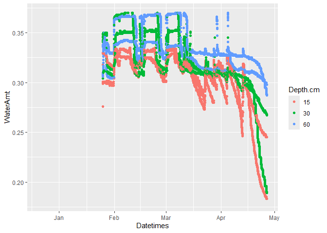
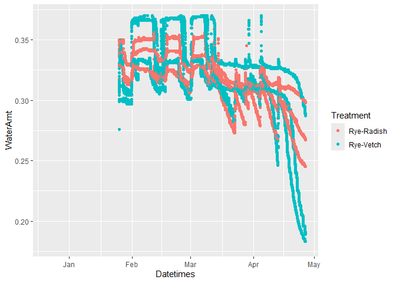

GT_Datawork
================
migs
2024-05-03

``` r
library(ggplot2)
library(magrittr)
library(readr)
library(RCurl)
library(tidyr)
```

    ## 
    ## Attaching package: 'tidyr'

    ## The following object is masked from 'package:RCurl':
    ## 
    ##     complete

    ## The following object is masked from 'package:magrittr':
    ## 
    ##     extract

``` r
library(tidyverse)
```

    ## ── Attaching core tidyverse packages ──────────────────────── tidyverse 2.0.0 ──
    ## ✔ dplyr     1.1.4     ✔ purrr     1.0.2
    ## ✔ forcats   1.0.0     ✔ stringr   1.5.1
    ## ✔ lubridate 1.9.3     ✔ tibble    3.2.1

    ## ── Conflicts ────────────────────────────────────────── tidyverse_conflicts() ──
    ## ✖ tidyr::complete()  masks RCurl::complete()
    ## ✖ tidyr::extract()   masks magrittr::extract()
    ## ✖ dplyr::filter()    masks stats::filter()
    ## ✖ dplyr::lag()       masks stats::lag()
    ## ✖ purrr::set_names() masks magrittr::set_names()
    ## ℹ Use the conflicted package (<http://conflicted.r-lib.org/>) to force all conflicts to become errors

``` r
#Timestamp vs. Water Content, color = Depth
ggplot(dataframe_A, aes(x = Datetimes, y = WaterAmt, color = Depth.cm)) +
  geom_point() + 
  scale_y_continuous(limits = c(0.18, 0.37)) ##Removes negative values from calibration
```

    ## Warning: Removed 33598 rows containing missing values or values outside the scale range
    ## (`geom_point()`).

<!-- -->

``` r
#Timestamp vs. Water Content, color = Treatment
ggplot(dataframe_A, aes(x = Datetimes, y = WaterAmt, color = Treatment)) +
  geom_point() + 
  scale_y_continuous(limits = c(0.18, 0.37)) ##Removes negative values from calibration
```

    ## Warning: Removed 33598 rows containing missing values or values outside the scale range
    ## (`geom_point()`).

<!-- -->
